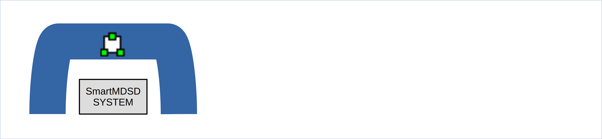

# SmartAAS-DSL

Asset Administration Shell (AAS) extensions for SmartMDSD Toolchain

## Asset Administration Shell
[What is the Asset Administration Shell](https://wiki.eclipse.org/BaSyx_/_Documentation_/_AssetAdministrationShell)

Asset Administration Shells (AAS) are one main concept of Industrie 4.0 for providing information hiding and higher levels of abstraction for assets.

[What is the Industry 4.0 Platform](https://www.plattform-i40.de/IP/Navigation/DE/Home/home.html)

The exchange of information between partners in the value chain of Industrie 4.0.

## Adding an AAS model to a SmartMDSD Component

In this tutorial, we will add an AAS model to an existing SmartMDSD component project. Here we have a component named "ComponentWebotsMobileRobot".


Right-click on the project, select the "Create new AAS Model" in the "New" menu.


Confirm the creation of SmartAAS model files with default contents. Existing SmartAAS model files, if any won't be changed. Delete existing SmartAAS model files in case you want them to be regenerated with the default contents.


SmartAAS model files are created with default contents.


SmartAAS command model for the component has the extension "aas_command".


SmartAAS sub-model structure model for the component has the extension "aas_sms".


AASX model (XML) for the component ends with "AAS.xml".


AASX model (XML) can be viewed in AASX explorer (Windows OS) as shown below.


You may Launch a SmartAAS Server for the given component taking the AASX model (XML) as input. This button (shown below) will launch the server (Detached from the Eclipse process) with the default configuration. Only one detached server can be launched at a time using this button. For more control over server configuration and to launch multiple servers, use Terminal (Explained later in "Populate an AAS Server from an existing AASXML model" tutorial).


Note: Detached SmartAAS Servers can be stopped by running the "StopAllRunningServers.sh" script.
```sh
~/SOFTWARE/smartsoft/SmartAASbox$ bash StopAllRunningServers.sh
```

## Adding an AAS model to a SmartMDSD System

In this tutorial, we will add an AAS model to an existing SmartMDSD system project. Here we have a system named "SystemWebotsLarryNavigation".


Right-click on the project, select the "Create new AAS Model" in the "New" menu.


Confirm the creation of SmartAAS model files with default contents. Existing SmartAAS model files, if any won't be changed. Delete existing SmartAAS model files in case you want them to be regenerated with the default contents.


SmartAAS model files are created with default contents.


SmartAAS command model for the component has the extension "aas_command".


SmartAAS sub-model structure model for the component has the extension "aas_sms".


AASX model (XML) for the component ends with "AAS.xml".


AASX model (XML) can be viewed in AASX explorer (Windows OS) as shown below.


You may Launch a SmartAAS Server for the given component taking the AASX model (XML) as input. This button (shown below) will launch the server (Detached from the Eclipse process) with the default configuration. Only one detached server can be launched at a time using this button. For more control over server configuration and to launch multiple servers, use Terminal (Explained later in "Populate an AAS Server from an existing AASXML model" tutorial).


Note: Detached SmartAAS Servers can be stopped by running the "StopAllRunningServers.sh" script.
```sh
~/SOFTWARE/smartsoft/SmartAASbox$ bash StopAllRunningServers.sh
```

## Populate an AAS Server from an existing AAS XML model

Find an executable jar named "smartmdsd2aas.jar" at "$HOME/SOFTWARE/smartsoft/SmartAASbox". In addition to Populating a AAS Server from an existing AASXML model (XML), this executable jar can also be used to Display sub-models of an given AASX model (XML), generate an AASX model (XML) with default contents, convert a component or system sub-model structure model (aas_sms) to equivalent AASX model (XML). Valid use cases for "smartmdsd2aas.jar" can be seen below.

To populate an AAS Server from an existing AASXML model, use the executable "smartmdsd2aas.jar" with the "RUN" option. You may set the Port Number for the AAS Server by setting the input variable "AASportnum". The AAS Server talks to a running "SmartMDSD system" via a Bridge component ["ComponentAASBridge"](https://github.com/Servicerobotics-Ulm/ComponentRepository/tree/master/ComponentAASBridge). The Bridge component and the AAS Server communicate with each other through web-sockets in the current implementation. You may set the socket number for this communication by setting the input variable "bridgesocket". Refresh rate and verbose for this communication channel can be set using the input variables "bridgetimer" and "bridgeverbos" respectively. Once launched, the "bridgesimulator.jar" executable will wait for a Bridge component connection before populating the AAS Server.

In case an actual Bridge component instance ["ComponentAASBridge"](https://github.com/Servicerobotics-Ulm/ComponentRepository/tree/master/ComponentAASBridge) is not running, The executable jar "bridgesimulator.jar" can be used to simulate a dummy Bridge component. The "smartmdsd2aas.jar" should already be waiting for a Bridge component connection before "bridgesimulator.jar" is launched.

Once the "bridgesimulator.jar" connects with an actual or simulated Bridge component, The SmartAAS Server is populated as configured.

URLs for "AAS Registry", "SmartAAS Server" and "SmartAAS Operations sub-model" can be read from the Terminal when the SmartAAS Server starts. 

URLs for "AAS Registry", "SmartAAS Server" and "SmartAAS Operations sub-model" can be used in a web browser to view the node-tree of a running AAS Server.


## Operation Invocation

A running SmartAAS Server populates "SmartAAS Operations sub-model", a collection of operations used to interact with a running "SmartMDSD system". This is true for any "SmartMDSD system" that includes the component ["ComponentAASBridge"](https://github.com/Servicerobotics-Ulm/ComponentRepository/tree/master/ComponentAASBridge) in its composition. Below, we can see a "SmartAAS Operations sub-model" attached to a "SmartAAS Server", which is connected to a running "SmartMDSD Server" via a Bridge component.

Operation in a "SmartAAS Operations sub-model" can be invoked using REST commands. A file with demo command calls to these operations can be found at "$HOME/SOFTWARE/smartsoft/SmartAASbox/SmartAASDemo.postman_collection.json". This file can be imported in ["Postman"](https://www.postman.com/) for running the demo command calls to the operations. The example below invokes the operation "PushCapability" attached to a running "SmartAAS Server".

The response of the operation "PushCapability" is received as shown below.

The "SmartAAS Server" receives and forwards the appropriate command to the running "SmartMDSD system".

Other operations can be invoked to start/stop the verbose, to clear server buffers and stop the server execution. Invoking "VERBOS_ON" operations below as an example.

Response for "VERBOS_ON" operations.

Effect of "VERBOS_ON" operations on "SmartAAS Server".

Invocation and response for "VERBOS_OFF" operations.

Effect of "VERBOS_OFF" operations on "SmartAAS Server".


